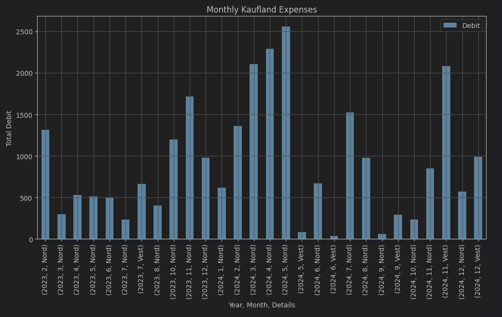

# Pandas practical examples
A beginner tutorial on the Python Pandas library 

### ING bank monthly statement analysis.
Have your monthly statements exported in xls files from HomeBank.

Put all of them into ./data/bank folder:

### Play with jupyter notebook and pandas
Get your grocery expenses:
